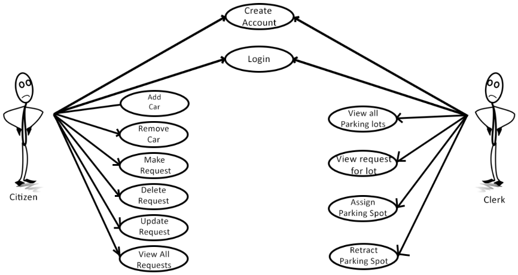
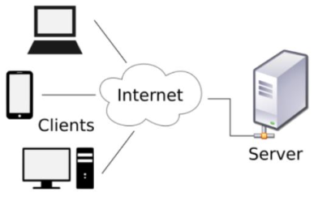
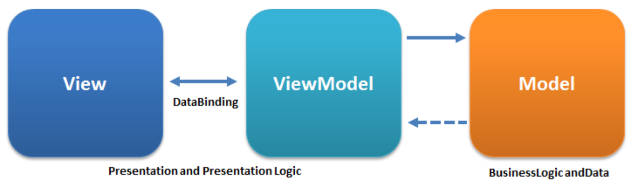

# Parking Request System

This is the application developed during the "Software Design" laboratory.  
The purpose of this project is to design and implement an application for an online Parking Request System. The main goal of the application is to provide a clear and transparent way of requesting and assigning parking spots of the parking lots of Cluj-Napoca.

**Use Case Diagram**

**Architectural Patterns Used**
 * Client-Server

 * MVVM

**Design Patterns Used**
 * DAO (Data Access Object) Pattern;
 * Factory Pattern;
 * Abstract Factory Pattern;
 * Command Pattern;
 * Transaction Script Pattern;
